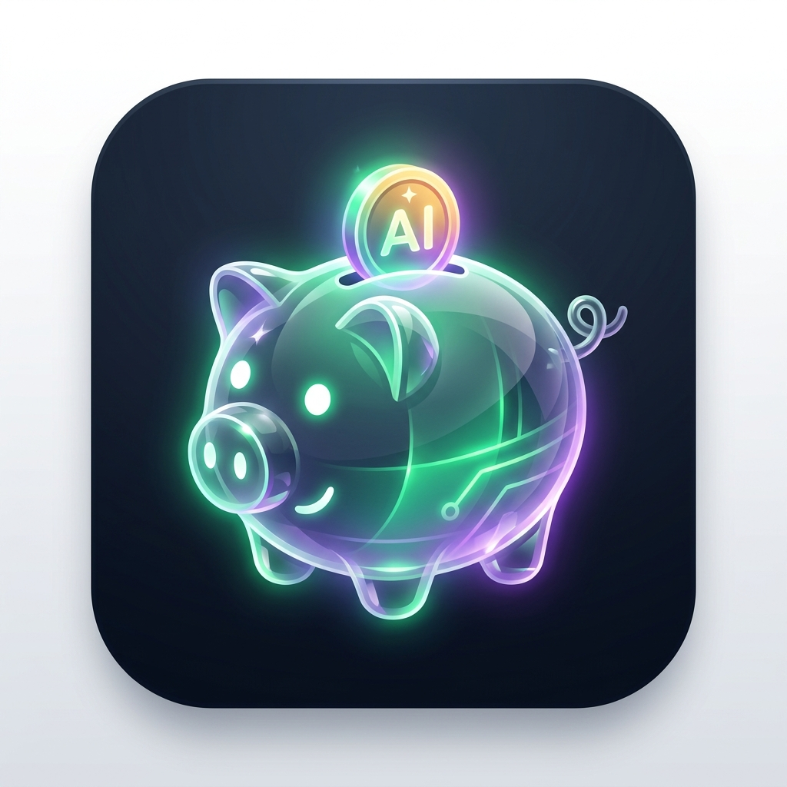

# 💎 Money Companion - Personal Budget Tracker

A lightweight, beginner-friendly, daily-usable personal budget tracker and financial companion built for early-career professionals. Designed to minimize effort (< 10 seconds per entry, < 1 minute per day) while maximizing visual clarity, savings, and smart AI insights.

## ✨ Key Features

- 🏠 **Dashboard**: Monthly income, monthly spent, remaining budget, safe daily limit calculator, 1-tap quick log hub.
- 💵 **Income Streams**: Salary, side hustle, bonuses, and recurring income tracking.
- 💸 **Expense Tracker**: <10-second quick entry modal with instant merchant search and category filters.
- ⚖️ **Budget Planner**: Category limit progress bars with 1-click 50/30/20 auto-allocator.
- 🏦 **Savings Fund**: Deposit logger with monthly savings rate counter.
- 🎯 **Financial Goals**: Milestone progress cards (Emergency Fund, Laptop, Vacation).
- 💡 **Wishlist & "Can I Buy This?" Evaluator**: Interactive purchase feasibility engine calculating real-time budget impact.
- 📊 **Visual Reports**: SVG Donut chart for spending by category and cash flow balance indicators.
- 🤖 **AI Money Companion Drawer**: Instant preset inquiry cards (*"Can I buy this?"*, *"How much budget is left?"*, *"What category am I spending the most on?"*).
- 💱 **Multi-Currency Selector**: Instant top-bar dropdown supporting `$`, `€`, `£`, `₹`, `¥`, `A$`, `C$`, `₱`, `R$`, `Fr`, `AED`, `RM`, `S$`.
- 🌙 **Light & Dark Theme**: Seamless glassmorphic design system.
- 📱 **Progressive Web App (PWA)**: Installable on iOS/Android home screens for 100% offline mobile use.

## 🚀 Live Vercel Deployment

Deploy directly to Vercel in 1 click!

